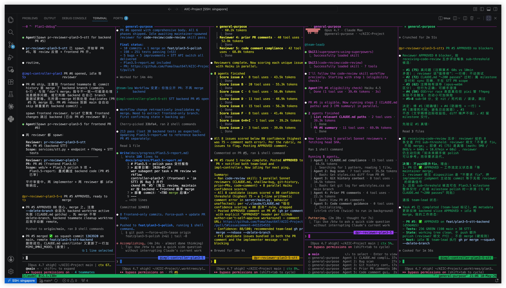

# Product Memo — ProjectProbe

> AI 模拟面试官·16 小时项目挑战交付
> 提交日期：2026-05-10
> 公网 URL：https://aiic.fomalhaut647.com（在线至 5/15 24:00）
> GitHub：https://github.com/Fomalhaut647/AIIC-Project（public）

---

## 1. 目标用户与核心痛点

**目标用户**：本科生，准备大厂实习面试或保研复试。

挑战开始前我访谈了 5 个北大本科生，目标是验证题面给的痛点描述是否在我身边的真实样本里成立。结论有点反直觉：

- **5/5 同意** 模拟面试能提高熟练度、防止怯场——题面假设在样本里完全成立
- **仅 2/5 愿意尝试** 这种产品
- **这 2 个愿意尝试的人也给不出具体理由和需求**

这意味着痛点是真实的，但用户对"我具体缺什么能力"的认知很模糊。这驱动了我整个产品哲学：

> 与其调研用户能描述出来的需求，不如做一个让用户体验后立刻被惊艳的具体能力——一种 ChatGPT 给不了的、第一次看到就让人意识到"原来这才是我需要的"东西。

后续所有功能取舍都回到这个原则。

---

## 2. 产品设计说明

### 2.1 核心功能

ProjectProbe 围绕「项目深度追问」场景，构建「用户介绍 → AI 追问 → 量化反馈 → 长期训练」闭环：

| 功能 | 价值 |
|---|---|
| **双 Agent 信息不对称** | Coach 懂你（onboarding 时讲过的所有材料）；Interviewer 装作不懂你，强制你把项目讲清楚 |
| **状态机六阶段** | S1 自我介绍 → S2 项目澄清 → S3 技术追问 → S4 反向提问 → S5 假设挑战 → S6 总结。每轮目标明确，不是无限循环 |
| **作弊模式 OS panel** | Coach 在 Interviewer 提问的同时，从背后给用户递推理线索（"建议从一致性问题切入"等）。这是 ChatGPT 同 session 做不到的——单 LLM 无法同时扮演两个信息不对称的角色 |
| **长期训练闭环** | 跨 session 弱点累积、一键重练单 slot、简历多轮迭代不限轮次、dashboard 时间线、Markdown 导出 |
| **多模态输入** | 文件上传（PDF/Word/MD/TXT 解析）+ 麦克风 STT + Interviewer TTS 朗读，三模态独立 toggle |

### 2.2 刻意不做的事

每条都直接对应「做让人惊艳的具体能力 vs 做用户期望的常规能力」的判断：

- **账号登录系统**——anonymous + localStorage 是设计意图，让用户 5 秒开始练。如果加 OAuth 会让"轻量 mock 工具"在产品入口前砸 30 秒
- **SQLite / 数据库化**——这是 mock 工具不是数据库系统，每次 session self-contained
- **多面试官 panel（Researcher / Engineer / 老板）**——会稀释双 Agent 信息不对称的设计哲学
- **OCR 简历图片 / 视频项目介绍上传**——大依赖 + 实际场景占比小
- **跨用户社区 / 群组对练 / 公开榜**——超出 16h 阶段范围

---

## 3. 版本迭代记录

### v1（已废弃，归档至分支 `archive/web-chat-v1`）

**最初方案**：基于 MiMo `mimo-v2.5-pro` 的通用 web chat 界面。

**遇到的问题**：跑通后我自己用了一遍，发现它和 ChatGPT 的区别只在「换了个 LLM 后端」。这违反核心评分句——评委不会因为我换了 LLM 就给"比 ChatGPT 更好"的分。

**怎么改**：彻底重新设计为 v2 ProjectProbe；v1 业务代码归档到分支 `archive/web-chat-v1`，main 重写。

### v2 ProjectProbe（核心闭环）

基于双 Agent + 状态机的项目深度追问场景。当时刻意砍掉了：跨设备登录、长期训练、多模态输入。

**关键转折**：v2 ship 后我意识到只有「单 session 内的项目深度追问闭环」，缺「跨 session 的训练价值」——一个 mock 工具用一次就走，比不上一个能让你回访看进步的工具。这驱动了 Plan2。

### Plan2 长期训练闭环

新增 5 个 features：F1 持久化 / F2 一键重练 / F4 简历多轮迭代 / F5 .md 导出 / F7 个人主页 dashboard。

**为什么这么改**：访谈结论里 5/5 都在说"防止怯场"——防止怯场不是单 session 能解决的，需要重复练习 + 看到自己的进步。Plan2 直接服务这个。把"看见弱点"延伸到"重练单 slot + 简历迭代收敛 + 历史时间线回访"。

### Plan3 多模态输入

新增：文件上传（PDF/Word/MD/TXT）+ STT 麦克风 + TTS 面试官朗读 + 双独立 toggle。

**遇到的问题**：第一版 STT 用 Chrome 原生 webkitSpeechRecognition，错误率高且不可控。

**Plan3.5 切换到 MiMo Omni 多模态 channel** via `/v1/chat/completions + input_audio` 字段（MiMo 没有标准 `/v1/audio/transcriptions` endpoint）。前端从 `webkitSpeechRecognition` 改 `MediaRecorder` + ffmpeg 转码 webm/opus → wav 16kHz mono，后端调 `mimo-v2-omni`。错误率从无法用降到可用。

### Plan3.5 polish + Plan3.6 layout fix

5 个 bugs（mic 椭圆 / 用户气泡对齐 / TTS autoplay 3-stack / OS layout 隐式解 / STT API 切换）+ 5 improvements（3 列 layout / 输入框加高 / OS panel 设计 / humor 模板）。Plan3.6 修右侧空间浪费 + OS panel overlay textarea bug。

**收尾**：Plan2 + Plan3 + Plan3.5 + Plan3.6 一共约 110 个 commit / 257 个测试通过 / 全部走过 PR review workflow。

---

## 4. 下一步设计（再给一周怎么做）

复用 `docs/plan4-brainstorm.md` 已起草的 P0 优先级，下一周沿三条主线深化：

**(一) 把"理解用户"从假设变成更深的证据**：当前 5 人访谈结论"用户说不出具体需求"本身就是 P0 信号——意味着访谈方法论需要变。下一周访谈 10-15 个**正在准备面试**的样本（而非"未来可能"），用具体场景（"上次面试你哪个问题答得最不满意 / 用 ChatGPT 哪里没满足你"）逼出隐性需求。

**(二) 把"长期训练"从可见变成可执行**：现状是 dashboard 让用户看见弱点，但下一步训练计划还是一段文字。新增 **I9 to-do 化训练计划**：把 next_training_plan 重构成 [{description, slot, status}] 结构化 todo，下次回访自动展示完成度。让"复盘 → 重练 → 改简历 → 行为追踪"闭环完整。

**(三) 把"反馈具体性"再加一层量化**：现状 Coach 给 missing_evidence 文字反馈，但"我改进了多少"用户感知不到。新增 **I3 简历评分量化**：Coach 对 resume_rewrite 的 original / rewritten / user_revised 各打 0-100 分，进度条展示"原 60 → Coach 78 → 用户改后 85"。

这三条都直接服务核心评分句——长期记忆、行为追踪、量化反馈，全部是 ChatGPT 单 session 无法做到的能力。

**刻意不做**（与 v2-v3 设计哲学一致）：多面试官 panel / OAuth 账号系统 / OCR / 视频上传 / SQLite 升级 / 跨用户社区。每条都对应"让 ChatGPT 给不了的具体能力"原则。

---

## 5. AI 工具使用

整个项目我用 **Claude Code (Opus 4.7) + 自己设计的多角色 AI 团队工作流** 实施。比"用 AI 写代码"更重要的是这套工作流——这是评分维度 4「有效使用 AI」的核心证据。

### 5.1 三角色分工

- **maintainer（我）**：读题、决策方向、brainstorm 优先级、PR 合并、人工浏览器实测捉 bug
- **leader / controller agent**：起草设计文档（spec）+ 实施计划（plan）+ 调度 implementer 与 reviewer
- **implementer agent**：在 git worktree 隔离实施 + commit + push + 开 PR
- **reviewer agent**：用 `code-review` skill 内部派 5 并行子 reviewer + Haiku confidence scoring（< 80 false positive 过滤）评审

三个 agent 角色 context 独立，避免 confirmation bias 互相污染——这是 reviewer 抓出真 bug 的关键。

### 5.2 我作为 maintainer 的关键介入点

- 每次起 implementer 前，**手动**在它的 session 里激活 skills（test-driven-development / verification-before-completion / systematic-debugging），并强制要求它派生子 agent 时显式 invoke 这些 skills——防止 agent "凭直觉" 跳过 RED 阶段或写假 verification report
- reviewer 反馈走 `receiving-code-review` 五步评估（read → understand → verify → evaluate → respond），不允许 implementer 凭直觉 push back
- 最后由 **maintainer 负责 `gh pr merge`**（不让 implementer 自 merge——工作流硬红线）+ 浏览器实测捉 bug
- post-merge 清理（worktree remove + branch -D + 服务器部署 + 写 Plan-report）

### 5.3 量化产出

- **约 110 commits / 4 个 milestone**（v2 + Plan2 + Plan3 + Plan3.5 + Plan3.6）
- **257 测试通过**
- Plan3 PR review 跑了 **3 个 review-fix iteration**（22 commits + 2 review-fix commits）
- Plan3.5 拆成 **2 个并行 PR** 实施（PR #5 backend STT + PR #6 frontend polish），分别走完独立 review

### 5.4 多模态 API

- **DeepSeek `deepseek-chat`**：Coach + Interviewer 双 LLM
- **MiMo `mimo-v2.5-tts`**：Interviewer TTS 朗读，OpenAI 兼容 `/v1/audio/speech`
- **MiMo `mimo-v2-omni`**：用户语音 STT，via `/v1/chat/completions + input_audio` 多模态 channel（MiMo 无标准 `/v1/audio/transcriptions`，是这次实施的关键发现）
- **ffmpeg**：webm/opus → wav 16kHz mono 转码（MiMo 服务器只解码 mp3/flac/m4a/wav/ogg）

### 5.5 我和 AI 的边界

- **AI 写**：所有代码（前后端）+ 测试 + spec / plan / report 文档草稿
- **我写**：CLAUDE.md 协作规范、产品方向决策、UI/UX 取舍判断、本 Memo 与 Demo 视频脚本草稿、生产环境运维（SSH / nginx / 证书）
- **fork 的部分**：无 fork；整个 main 分支是 v1 后从空白重写

挑战的核心不是"能不能写代码"，而是"能不能让 AI 团队按工程纪律产出可用产品"。这套工作流的输出质量明显高于任何单 agent 一次跑完的形态——比如 Plan3 PR review 抓出 .docx 异常族三种类型，spec 阶段 / 单 agent 写都不会发现。
